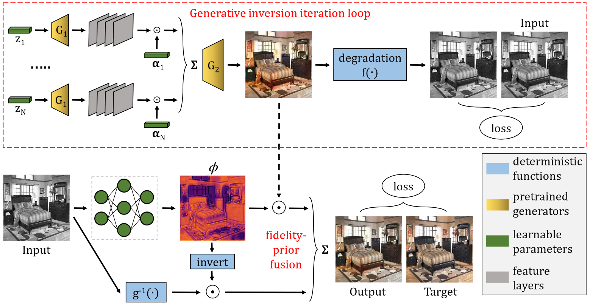

# BIGPrior: Towards Decoupling Learned Prior Hallucination and Data Fidelity in Image Restoration

**Authors**: [Majed El Helou](https://majedelhelou.github.io/), and Sabine Süsstrunk


{Note: paper under submission}

## BIGPrior pipeline
The figure below illustrates the BIGPrior pipeline, with a generative-network inversion for the learned prior. 
<p align="center">
  
</p>


#### [[Paper]](https://arxiv.org/abs/2011.01406)

> **Abstract:** *Image restoration, such as denoising, inpainting, colorization, etc. encompasses fundamental image processing tasks that have been addressed with different algorithms and deep learning methods. Classical image restoration algorithms leverage a variety of priors, either implicitly or explicitly. Their priors are hand-designed and their corresponding weights are heuristically assigned. Thus, deep learning methods often produce superior image restoration quality. Deep networks are, however, capable of strong and hardly-predictable hallucinations of the data to be restored. Networks jointly and implicitly learn to be faithful to the observed data while learning an image prior, and the separation of original data and hallucinated data downstream is then not possible. This limits their wide-spread adoption in image restoration applications. Furthermore, it is often the hallucinated part that is victim to degradation-model overfitting.*
>
> *We present an approach with decoupled network-prior based hallucination and data fidelity terms. We refer to our framework as the Bayesian Integration of a Generative Prior (BIGPrior). Our BIGPrior method is rooted in a Bayesian restoration framework, and tightly connected to classical restoration methods. In fact, our approach can be viewed as a generalization of a large family of classical restoration algorithms. We leverage a recent network inversion method to extract image prior information from a generative network. We show on image colorization, inpainting, and denoising that our framework consistently improves the prior results through good integration of data fidelity. Our method, though partly reliant on the quality of the generative network inversion, is competitive with state-of-the-art supervised and task-specific restoration methods. It also provides an additional metric that sets forth the degree of prior reliance per pixel. Indeed, the per pixel contributions of the decoupled data fidelity and prior terms are readily available in our proposed framework.*

**Key take-aways:** our paper presents a learning-based restoration framework that forms a _generalization of various families of classical methods_. It is both tightly connected with Bayesian estimation upon which it builds, and also to classical dictionary methods. Our BIGPrior makes the _explicit integration of learned-network priors possible_, notably a generative-network prior. Its biggest advantage is that, by decoupling data fidelity and prior hallucination, it structurally provides a _per pixel fusion metric_ that determines the contribution of each. This can be important both for end users and for various downstream applications. We hope this work will foster future learning methods with clearly decoupled network hallucinations, both for interpretability, reliability, and to safeguard against the hazards of black-box restoration. 


## Structure overview
All code is in the `code` directory, and _input_ data are in the `data` folder. The `net_data` directory stores the network weights per epoch (along with many other trackers and all experiment parameters), it uses an automated index incrementation strategy on top of the experiment name for avoiding over-writing. We generate a lot of intermediate data for the different experiments, and along with the final outputs, these are written in `inter_data`.


## Data setup
The needed data are already stored under `data`, if you want to repeat our experiments with different datasets we added a help [README](https://github.com/majedelhelou/BIGPrior/tree/main/data/lsun) under `data/lsun/` explaining how to pre-process the lsun data.


## Generative inversion
The generative inversion we use is based on [mGAN](https://github.com/genforce/mganprior) but we do some modifications to their code, which is why we have our own version in this repository.

**(1)** You need to download the pre-trained generative networks (we use PGGAN), and put the `pretrain` folder inside `code/mganprior/models/`. You can download them from the original repo, or mGAN's, or from our link [right here](https://drive.google.com/drive/folders/1nWk76mPtPxWrd9-tPJA3H7zyQmHLYznQ?usp=sharing).

**(2)** *(recommended)* You might face some bugs with the perceptual vgg-based loss due to caching, if you run parallel experiments or if you run on remote servers. We recommend you cache the pretrained model. To do this, first download [vgg model vgg16-397923af.pth](https://drive.google.com/file/d/1wp2MKTNT7wqgcZhCDTJYEZ46oYbdopsG/view?usp=sharing) and paste it inside `cache/torch/checkpoints/`, then before starting an experiment run:
```
export XDG_CACHE_HOME=cache/
```

**(3)** We compiled the commands for all experiments in the bash file `runall_mGAN.sh`, you can find the templates inside to rerun each experiment.


## Training
The `train_cnn.sh` bash compiles the commands to retrain all our experiments, for instance for colorization:
```
python code/train.py --experiment col_bedroom --lr 0.01 --batch_size 8 --backbone D --phi_weight 1e-5
```
the experiment name is parsed in 2 to determine the task and the dataset, the remaining args control the network or training parameters. All are detailed in `code/train.py`.

If you retrain multiple times for a given experiment, every run is saved with an incremented ID starting from 0, and the corresponding parameters are also saved as `OURargs.txt` next to the network checkpoints.

## Testing
The `test_cnn.sh` bash compiles the commands to test all our experiments, for instance for colorization:
```
python code/train.py --experiment col_bedroom --test_model 1 --test True --test_epoch 24
```
where the _test\_model_ argument selects the ID of the already-trained experiment. The arguments of the chosen experiments are also saved under `inter_data/{experiment}/OURoutput/OURargs.txt` because, unlike network weights, the image outputs get over-written with every new run. This is because their computation is fast but they take a lot of storage.

**Note:** our pretrained models are already available within this repo under `net_data` (epoch 25 only, i.e. ID 24), so if you want to test without retraining it can be done directly.

## Results visualization
We group all results processing, visualization, quantitative assessment, also including our correlation analysis figure, in one comprehensive [notebook](https://github.com/majedelhelou/BIGPrior/blob/main/code/visualization.ipynb). It contains a large number of control parameters to obtain all the different table results, and more.

## Citation
```bibtex
@article{elhelou2020bigprior,
    title   = {{BIGPrior}: Towards Decoupling Learned Prior Hallucination and Data Fidelity in Image Restoration},
    author  = {El Helou, Majed and S\"usstrunk, Sabine},
    journal = {arXiv preprint arXiv:2011.01406},
    year    = {2020}
}
```
